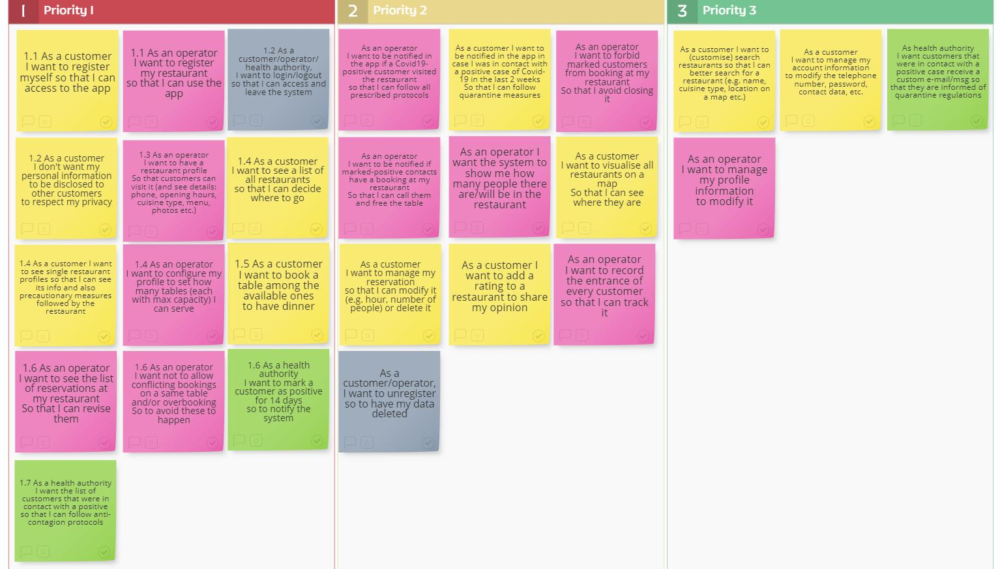
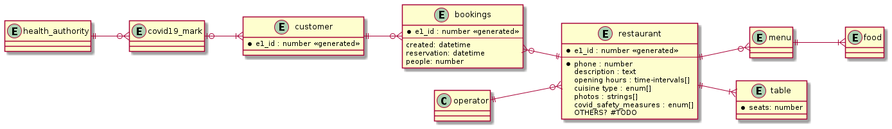

  

# Getting started

## Development
### Local
    # Install Dependencies
    pip install -r requirements/dev.txt
    # Deploy
    flask deploy

    # Start Server mail
    python -m smtpd -n -c DebuggingServer localhost:8025
    # Start Redis
    docker run --name redis -p 6379:6379 redis
    # Start Celery
    celery -A gooutsafe.celery worker -l DEBUG -E -B
    # Start Elasticsearch
    docker run -p 9200:9200 -p 9300:9300 -e "discovery.type=single-node" docker.elastic.co/elasticsearch/elasticsearch:7.10.0
    
    # Run 
    export FLASK_APP="gooutsafe"
    export FLASK_ENV=development
    flask run

### Docker Image
    docker build -t gooutsafe:latest . 

To run with settings

    docker run --name gooutsafe -d -p 8000:5000 --rm -e SECRET_KEY=my-secret-key \
        -e MAIL_SERVER=smtp.gmail.com -e MAIL_PORT=587 -e MAIL_USE_TLS=1 \
        -e MAIL_USERNAME=<your-gmail-username> -e MAIL_PASSWORD=<your-gmail-password> \ gooutsafe:latest

To run without settings

    docker run --name gooutsafe -d -p 8000:5000 --rm gooutsafe:latest

#### If no mail is provided, run the following for a mock smtp
    python -m smtpd -n -c DebuggingServer localhost:8025

### Docker-compose
Create a `.env` file with the environment variables requested by docker-compose.yml

    docker-compose build
    docker-compose --env-file .env up
## Tests with coverage
Inside GoOutSafe run (it will automatically use the configuration in pyproject.toml):

    pytest

If you want to see an interactive report run:

    coverage html

## Documentation
### User stories

### E-R Diagram in PlantUML

